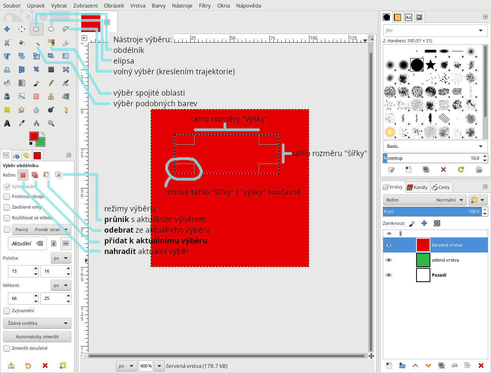
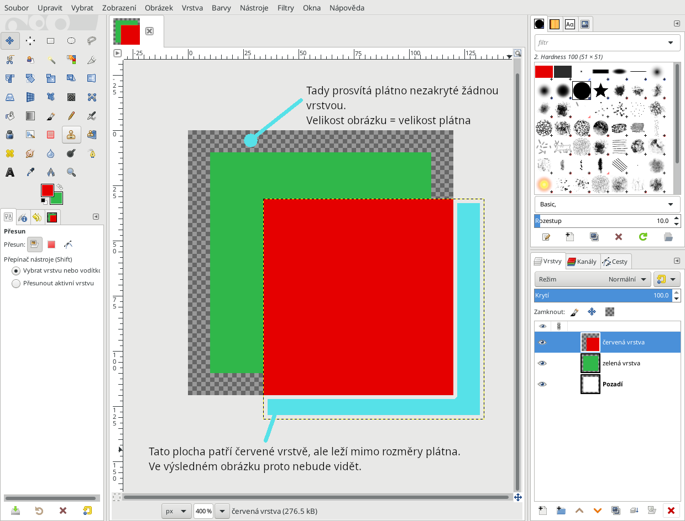
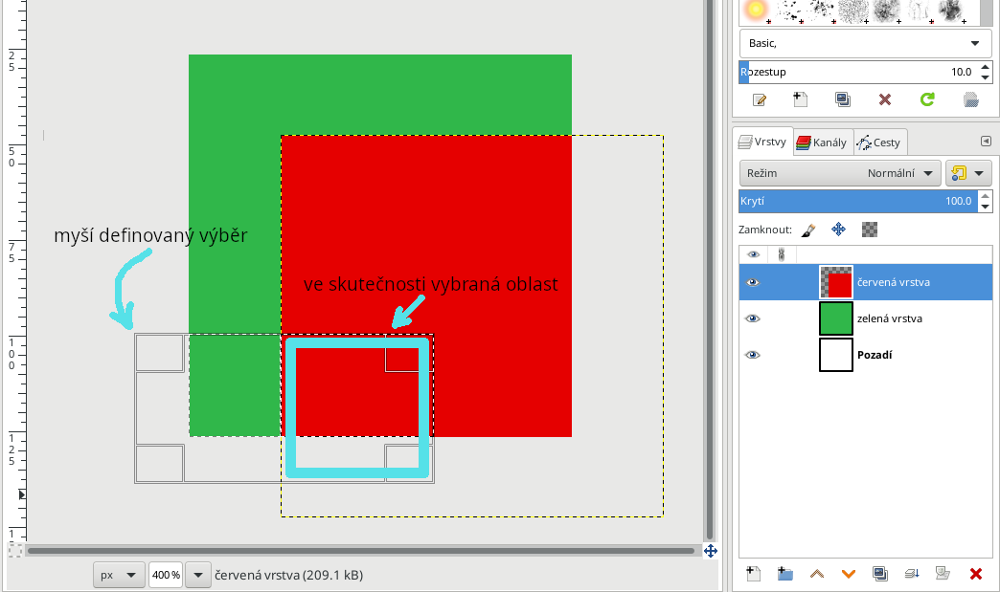

## Nástroje pro výběr oblastí práci s vrstvami

**Obrázek** má rozměry *plátna* a jsou na něm vidět *vrstvy* přeložené přes sebe.

**Vrstvu** si můžeme představit vlastně jako fólie (která může být i průhledná), její rozměry nejsou nijak spjaté s rozměry plátna.

**Výběr** je oblast na obrázku. Pozor, dokud nezmáčnete Enter, nebo neklepnete 1x levým do výběru, tak můžete stále libovolně měnit plochu výběru a také vpravo dole klepnout na vrstvu, ze které se má výběr vytvořit (lze vybrat právě jednu vrstvu).
Pomocí táhel se mění rozměry výběru.

Pomocí **režimu výběru** K aktuálnímu výběru se dá přidat/odebrat (=přičíst/odečíst) další výběry.

## Rozměry hranic plátna
Plátno je reálná plocha obrázek, která se uloží při Exportu. Co je mimo ni, nebude vidět.

## Výběr patří pouze aktuální vrstvě
Nevadí, že leží mimo plátno. Záleží jen na tom, kde jsou hranice **vrstvy**. Pokud by byla aktivní Zelená vrstva, bude vybraná oblast vypadat jako zelený obdélník umístěný vpravo nahoře v rámci výběru. Ostatní plocha by byla prázdná (pozor, žádná bílá).

## Vrstvy
Po výběru **Ctrl + C** a **Ctrl + V** vznikne plovoucí vrstvu a s tou je třeba se nejdřív vypořádat.

**Ukotvit** - "zaplácne" výběr do vrstvy níže (prostě tu plochu přebarví) a dál už s tím nic neuděláte

**Vytvořit novou vrstvu** - flexibilnější, protože nezmění zdrojovou vrstvu, je prostě samostatná
