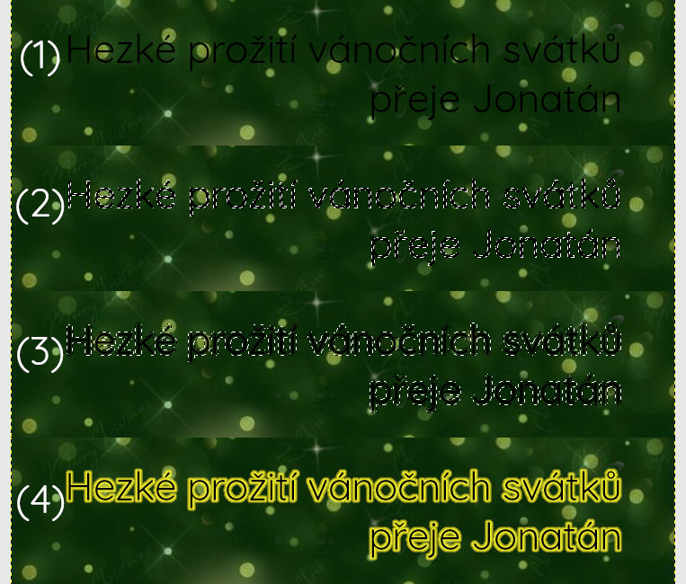

# Vánoční pohlednice

V této části si vytvoříme vánoční přání - pohlednici.

Odpíchneme se od obrázku publikovaném na 
https://vanocni-pohoda.cz/vanocni-prani-zdarma-ke-stazeni/

## Odstranění původního textu

Je velmi běžné, že krom kýženého motivu je na obrázku i text, který bychom rádi třeba doplnili, nebo úplně nahradili. Jenže text tam je nedílnou součástí a bylo by velmi namáhavé se snažit trefit do původního fontu, takže jej nahradíme kompletně.

* klonovací razítko
* volný výběr oblasti, hodí se povolit a zvětšit prolnutí okrajů
* klidně kopii/výběr ukotvit do původního obrázku

... nakonec se dopracujeme k této podobě:

## Vložení textu

* `(1)` text černý na tmavém pozadí - malý kontrast 
* duplikovat textovou vrstvu
* zvětšit duplikovanou vrstvu přes Velikost vrstvy dle obrázku
* `(2)` vybrat oblast s textem (podle barvy)
* `(3)` zvětšit výběr o 3px, styl okraje Feathered
* `(4)` vybrat žlutou barvu a rozlít ji do výběru

## Výsledek

