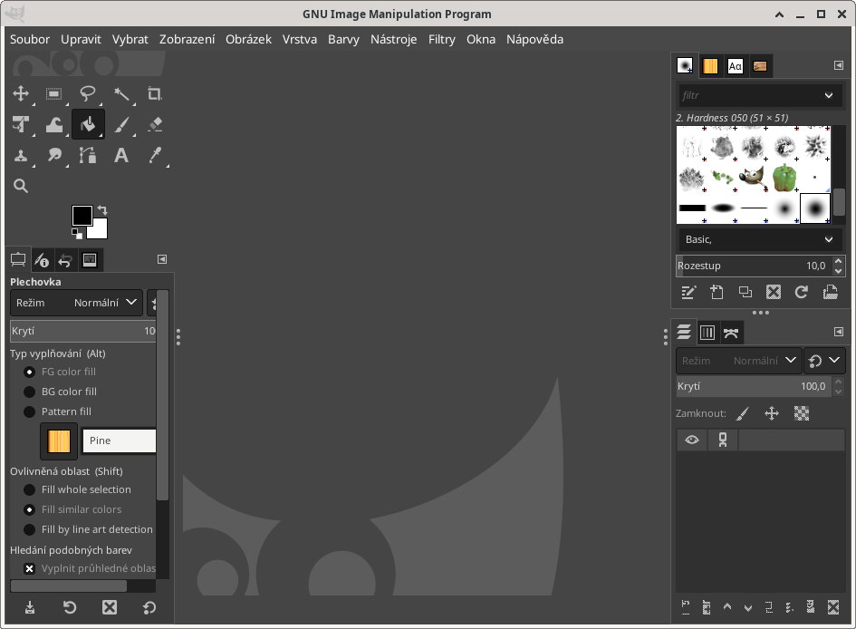
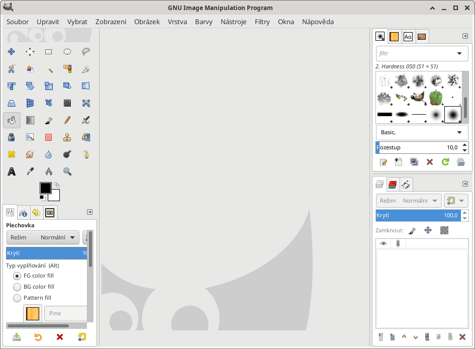

# Nastavení GIMPu použité v tomto workshopu

Veškeré zde použité obrázky z GIMPu jsou pořízené z mírně upraveného vzhledu.

Po instalaci vypadá takto:

V menu **Upravit** vyber **Předvolby**, dále **Rozhraní**:
  * Motiv: System (světlý)
  * Motiv ikon: Legacy (barevné ikonky)
  * Panel nástrojů: **odškrtnout** *Seskupovat nástroje* (User tool groups)

Po tomto nastavení by měla aplikace vypadat takto:

