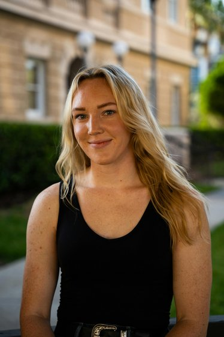
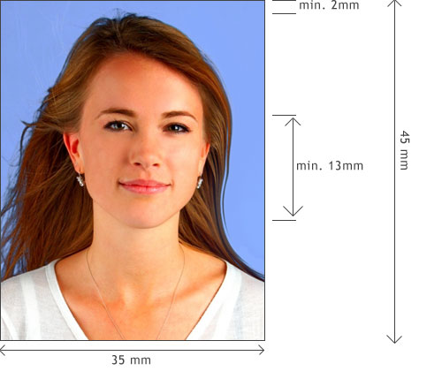
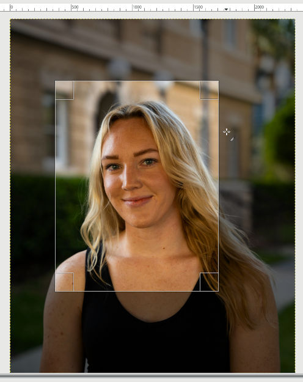
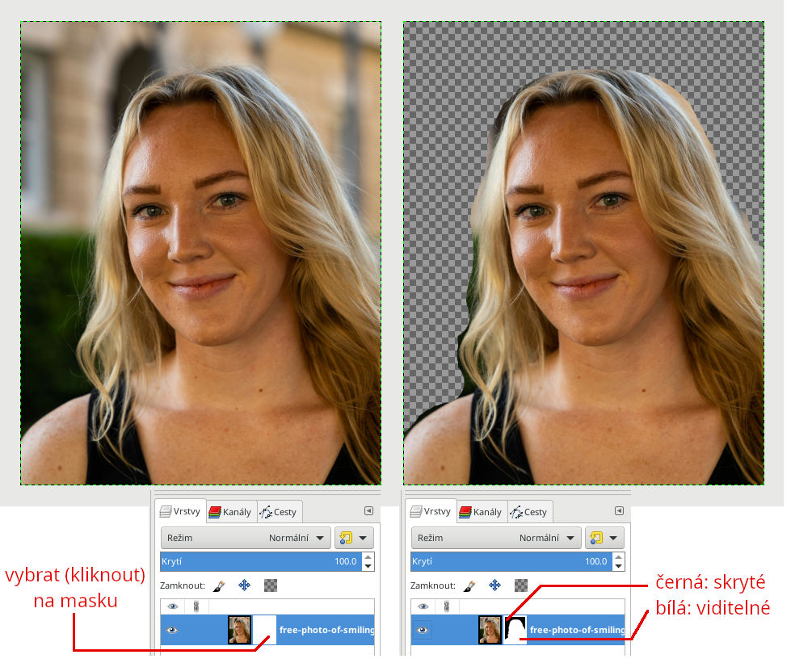
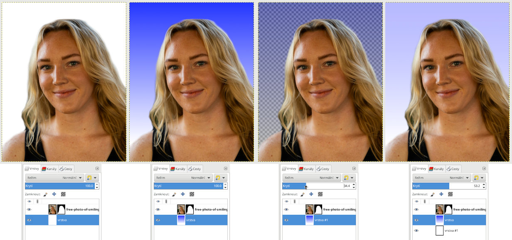
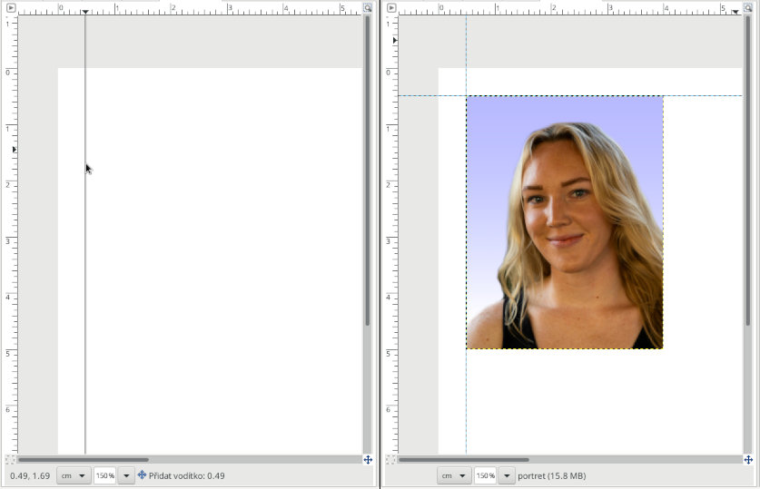
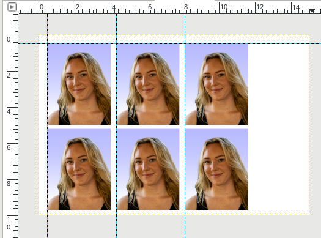

# Průkazové foto

Vyzkoušíme si upravit doma focený obrázek do podoby průkazové fotografie (např. na průkazku na autobus).

> [warning] Upozornění:
> Pro oficiální použití (občanský průkaz, pas, ...) nejsou jakékoli úpravy a retuše přípustné.
> Naštěstí je dneska již běžné, že si vás na úřadě podle potřeby vyfotí na místě.

Použijeme obrázek publikovaný na 
https://www.pexels.com/photo/smiling-blond-girl-in-front-of-a-building-17244497/

Na průkazové foto je kladeno víc požadavků, hezky to je popsané na https://www.fotoradce.cz/jak-na-prukazove-fotografie-1-dil. Odkud pochází i následující obrázek s rozměry:

## Ořez
Reálnou velikost budeme řešit až úplně na konec. Nejdřív vyřešíme poměr stran ořezu.
* pevný, nejsnáze `35:45` protože rozměry výsledného obrázku musí být 35x45mm. Že bude teďka reálně vzato větší nevadí, zmenšíme to až na konec.

## Odstranění pozadí pomocí masky vrstvy
* maska je super praktická, protože neodstraňuje pixely, jen je nezobrazí
* přidat masku vrstvy, **bílá** (full opacity)
* vybrat masku, aby byla aktivní
* kreslení **černou** barvou do masky "umazává" obrázek

## Přidáváme nové pozadí
* nová vrstva, celá bílá
* uspořádat vrstvy tak, aby bílá byla dole a ta s portrétem nahoře
* vyzkoušet si barevný přechod z modré do bílé

Po nahrazení pozadí bílou barvou či barevným přechodem.

Pomocí průhlednosti vrstev se dá pohodlně měnit množství krytí, třeba modrého přechodu.

## Příprava na tisk

Dnes běžným formátem tištěných fotografií je rozměr 10x15cm. Když jsme si už dali tu práci s jedním obrázkem, byla by škoda si jich rovnou nenachystat víc a pokrýt jím celou plochu fotopapíru.

* Obrázek - Duplikovat
* (panel Vrstvy) Zploštit
* zkopírovat výslednou vrstvu

Dále si nachystáme nový obrázek pro tisk:
* Soubor - Nový...
  * Velikost obrázku: 150x100 mm (pozor na jednotky!)
  * Pokročilé volby:
    * rozlišení 150dpi (pixelů/in) pro X a Y
    * Vyplnit s: bílá
* vložit (tu zploštěnou) vrstu a vytvořit z ní novou vrstvu, nekotvit! Pojmenovat tuto vrstvu: `portret` (slouží pouze pro naši lepší orientaci, není nezbytné)
* zmenšit vrstvu `portret` na 45x35mm (jednotky!)
* umístit pravítka
* duplikovat `portet`, sloučit dolů... opakovat podle potřeby

Po vhodném rozložení na plochu se dostaneme této podobě:

A úplně nakonec provedeme Export od `jpg` (stačí kvalita 80%) a necháme si vytisknout v lesklé povrchové úpravě, což vyjde na zlomek ceny oproti focení u fotografa. (A na *takovéto domácí žvýkání* to stačí 😊).

