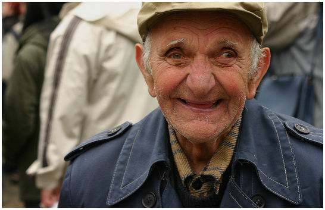
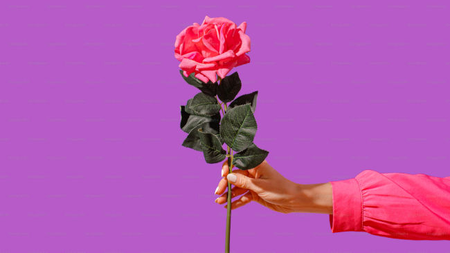
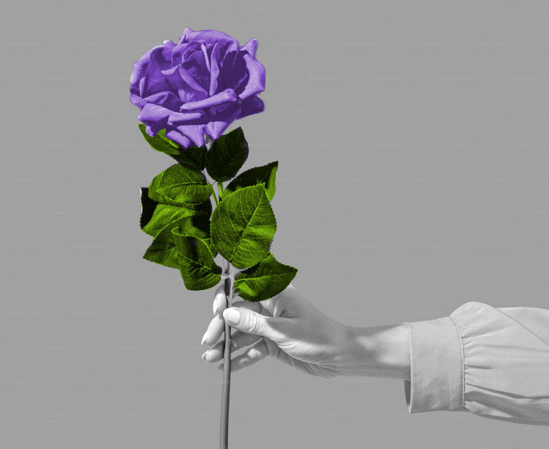
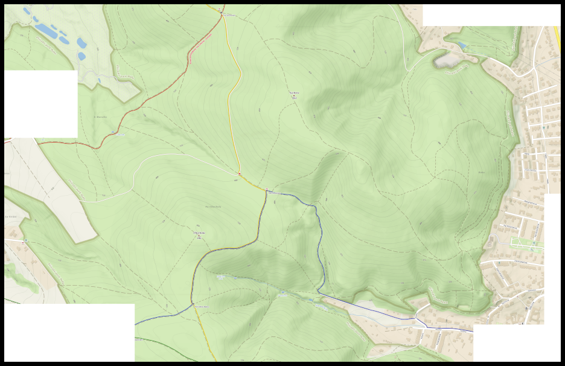

# Náměty na další zkoušení

### starší pán
Originál: https://commons.wikimedia.org/wiki/File:Happy_Old_Man.jpg
* převést do odstínů šedi
* pohrát si s jasem/kontrastem
* odstranit pozadí za postavou

### růže
Originál: https://plus.unsplash.com/premium_photo-1675857197763-7e1d015ab568
* desaturace
* kolorizace

### velká mapa z Mapy.cz
* poskládat mapu "z blízka" do větší plochy, než je tvůj monitor

