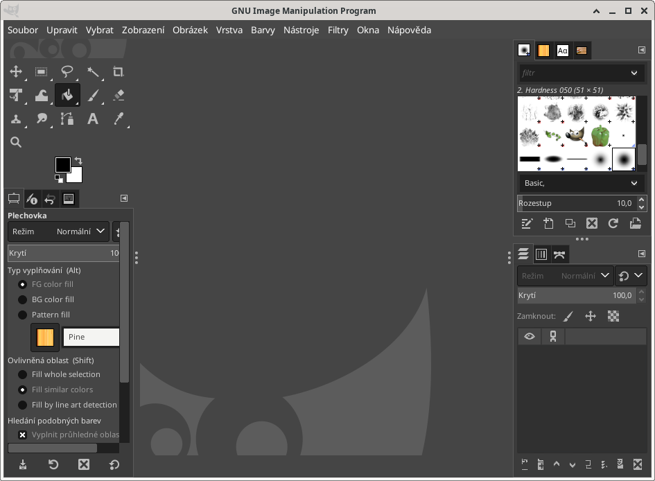
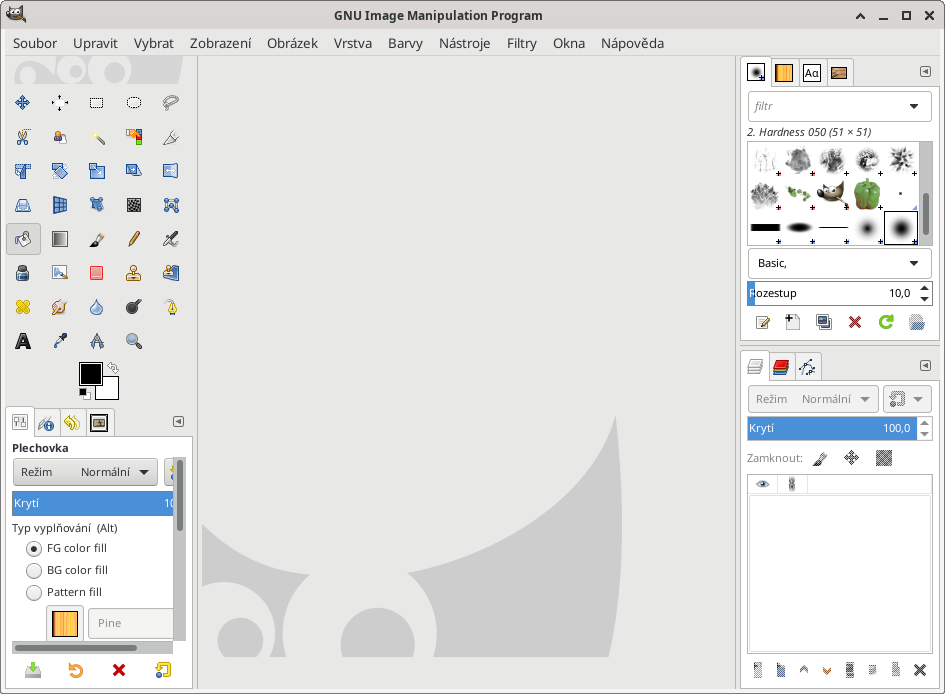

# Nastavení GIMPu použité v tomto workshopu

Veškeré zde použité obrázky z GIMPu jsou pořízené z mírně upraveného vzhledu.

Po instalaci vypadá takto:

V menu **Upravit** vyber **Předvolby**, dále **Rozhraní**:
  * Motiv: System (světlý)
  * Motiv ikon: Legacy (barevné ikonky)
  * Panel nástrojů: **odškrtnout** *Seskupovat nástroje* (User tool groups)

Po tomto nastavení by měla aplikace vypadat takto:

# Nový obrázek
Nabídka Soubor:
* z URL: **Otevřít umístění**
* screenshot: **Vytvořit - **

## Ovládání
- vrstva vs. plátno
- Ctrl + scroll: zoom
- uložit vs. exportovat

## Vrstvy
- plovoucí
- rozměry vrsty
- posun víc vrstev najednou
- nejde označit a zkopírovat více vrstev najednou
- průhlednost

## Výběr oblastí
- výběr ručně, režimy (nahradit, přidat, odebrat, průnik)
- podle barvy
- rychlá maska
- maska vrstvy

## Kreslící nástroje
- štětec vs. tužka
- šířka stopy

## Post processing barev, jasu, ...
* jas, kontrast (pomocí křivek)

## Ovládací rozhraní
- guides

## Filtry
- blur

