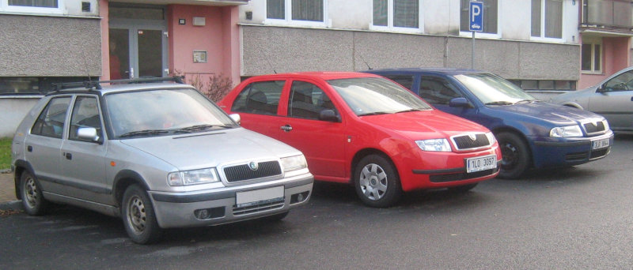
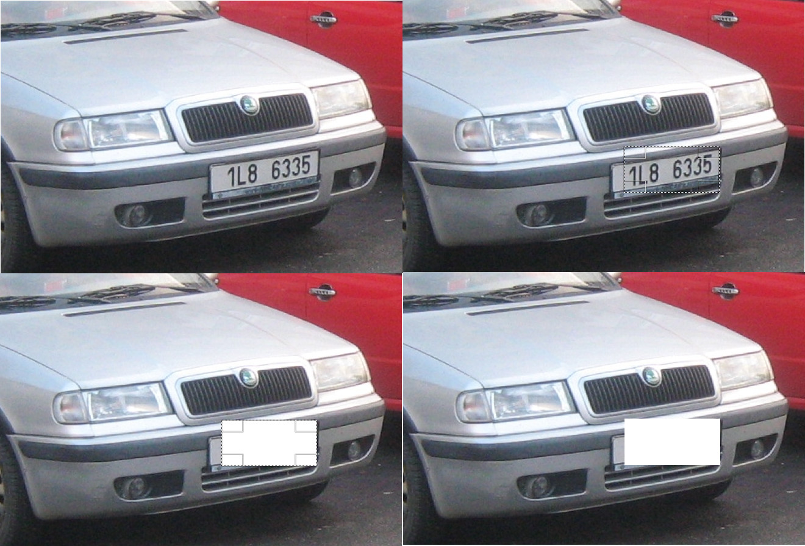
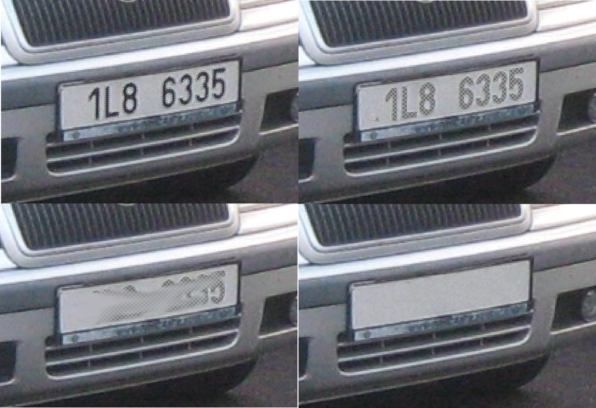

# Maskování citlivých dat

Vyzkoušíme si to na tomto obrázku z Wikimedia: https://commons.wikimedia.org/wiki/File:%C5%A0koda_Felicia%2BFabia%2BOctavia.jpg

Před:

Po:

## Nejjednodušeji: Vybrat obdélník a vymazat
* vybrat obdélník
* vymazat (tlačítko Delete)

## Lépe: Výběrem i podle barvy
* ručně obkroužit oblast (Laso)
* použít nástroj Výběr dle barvy, režim Průnik s aktuálním výběrem
  * práh cca 60
* Přidat alfa kanál
* **Jen vyzkoušet** (tady nevhodné): nástroj rozmazání přes průhledné oblasti - nevypadá to dobře
* Delete
* Vybrat nic (Ctrl + Shift + A)
* Klonování: Ctrl+klik levou myší na zdroj, pak drag & drop na kreslení podle zdroje

