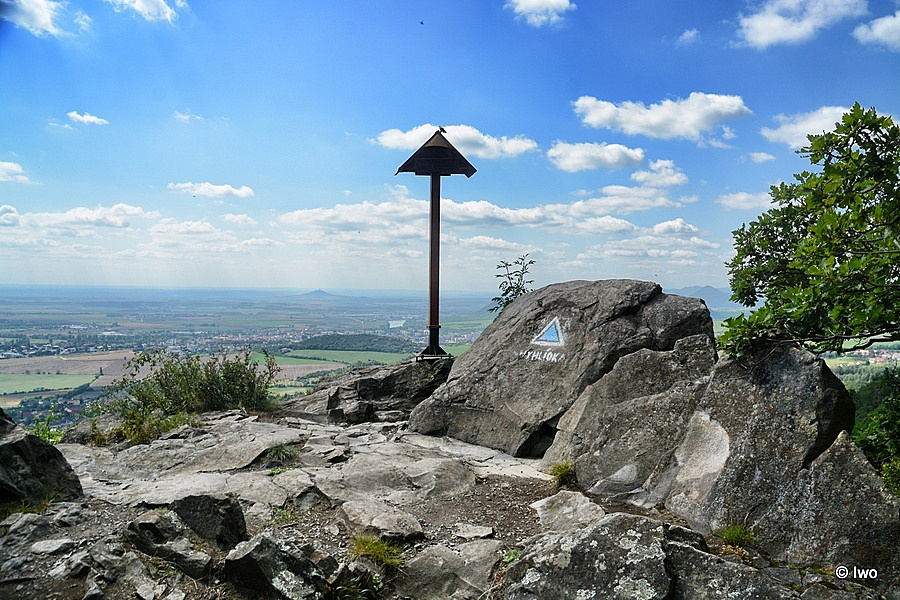
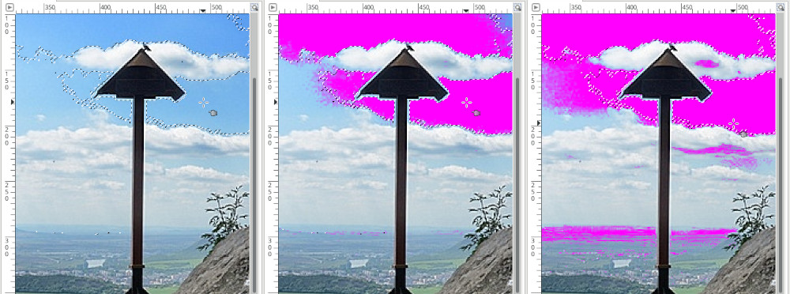
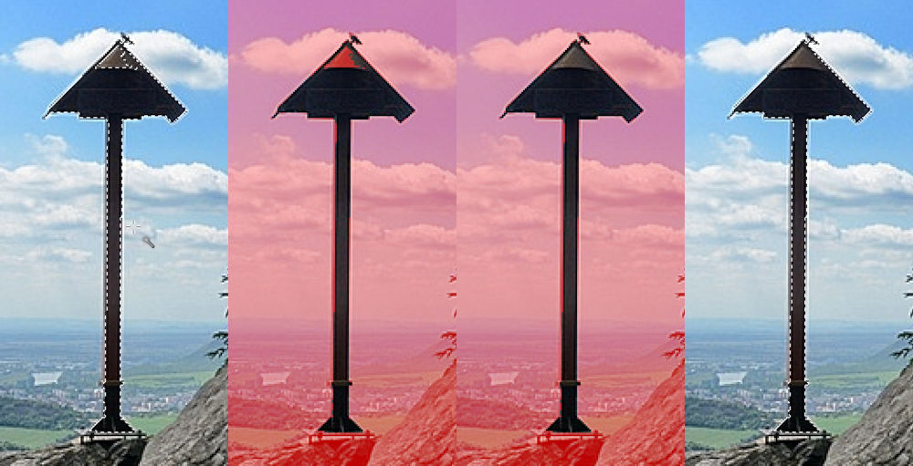

## Výběr objektu na obrázku

Použijeme obrázek publikovaný na 
https://www.cokolivokoli.cz/53399-lafitova-vyhlidka-pod-krizovou-horou/

### Výběr podle barvy, nebo oblasti?
Zkusíme si vybrat nožku se stříškou, nejprve pomocí oblasti. Hodnota **práh** určuje jak moc budou do výběru zahrnuté i sousední pixely od vybraného bodu.
Práh se dá nastavit buď číslem, nebo pohodlněji tažením myši (táhni & pusť) do stran.

(Na ukázkách níže je pro názornost vybraný kus oblohy a plocha zvýrazněná díky aktivnímu zatržítku **Vykreslit masku**.)

### Rychlá maska
* **Shift + Q**
* Kreslení **bílou** - bude vybráno
* Kreslení **černou** - nebude vybráno

